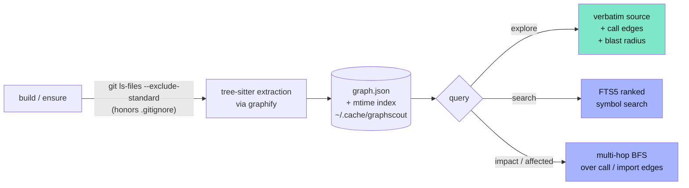

<div align="center">



<br/>

[](https://pypi.org/project/graphscout/)
[](https://pypi.org/project/graphscout/)
[](https://github.com/nguyenminhduc9988/graphscout/actions/workflows/ci.yml)
[](https://pypi.org/project/graphscout/)
[](LICENSE)
[](#-mcp-wired-automatically)
[](https://github.com/nguyenminhduc9988/graphscout/stargazers)

[](https://github.com/nguyenminhduc9988/graphscout)

<br/>

<a href="#-install"></a>
&nbsp;
<a href="#-mcp-wired-automatically"></a>
&nbsp;
<a href="#-benchmark"></a>

</div>

---

<div align="center">

<br/>
<sub>▲ Real captured CLI output, not mockups — every line comes from an actual <code>graphscout</code> run on this repo.</sub>
</div>

<br/>

> **The problem.** AI agents burn most of their tokens *reading source files* to answer structural questions — *"where is this defined?"*, *"who calls this?"*, *"what breaks if I change it?"*
>
> **The fix.** `graphscout` answers those from a cached tree-sitter AST graph in milliseconds — and **`explore` returns the matching symbols' verbatim source plus their call edges and blast radius in one call**, so the agent usually doesn't need a follow-up `Read` at all.

<div align="center">

<br/>
<sup>Measured, not asserted — see <a href="#-benchmark">Benchmark</a> for methodology and how to reproduce it yourself.</sup>
</div>

<br/>

One `build` per repo; after that, every query auto-refreshes only the files that changed since the last call (mtime-based). No forced background process, no external database, no API keys — a JSON cache under `~/.cache/graphscout`, plus an in-memory SQLite FTS5 index built on demand for search. Want it always fresh with zero per-query overhead instead? Run `graphscout watch`.

<sub>Formerly published as <code>codegraph-kit</code> (repo <code>codegraph</code>) — renamed to avoid confusion with the unrelated, much larger <a href="https://github.com/colbymchenry/codegraph">colbymchenry/codegraph</a>. Same cache format (<code>$CODEGRAPH_CACHE</code> still works). See <a href="#-honest-comparison-vs-colbymchenrycodegraph">Honest comparison</a> for exactly where each tool wins.</sub>

## 🆕 New in 0.6.0

Six more graph-backed capabilities — answers neither codegraph gives, each built
on data graphscout already extracts instead of a fresh pass:

- **`metrics [query]`** — per-symbol complexity cards: **fan-in** (how many sites
  call it — load-bearing), **fan-out** (how many distinct callees — a complexity
  proxy), reference/type edges in & out, and inferred body lines. With a name,
  one symbol's card; without, the repo ranked two ways — top fan-out
  (likely-too-big functions) and top fan-in (hubs many callers depend on).
- **`dupes`** — copy-paste / near-identical function bodies across files. Bodies
  are normalized (comments, whitespace, case stripped; the declaration line
  dropped so two functions with identical bodies but different names still
  cluster). A call graph can't see this at all — two identical helpers have no
  edge between them.
- **`recent`** — symbols in files touched by the last N commits. Lighter than
  `diff` (two explicit refs): this is the churn-window "what's been moving
  lately" view for orienting on a repo.
- **`why <a> <b>`** — shortest call chain from one symbol to another over
  resolved call edges. The two-symbol "why does A depend on B" question that
  `impact` (undirected blast radius from one seed) doesn't directly answer.
- **`tokens <name>`** — token cost of one symbol's body: "is it worth reading
  the whole thing, or take the outline first?" The single most on-brand metric
  for a tool whose purpose is to stop agents reading whole files. tiktoken
  (cl100k) when installed, else a chars/4 heuristic within ~15%.
- **`viz --kind=imports`** — the existing call-graph viz now also draws the
  **file-level module dependency graph** (the shape `cycles`/`affected`/`rdeps`
  operate on), as Mermaid or Graphviz DOT.
- `doctor` gains a **tiktoken** capability check, and all six new commands ship
  with `--json` output and matching MCP tools.

## 🆕 New in 0.5.0

Beyond the one-call `explore`, graphscout now answers questions the underlying
graph never used to surface directly:

- **`diff <ref> [ref2]`** — symbol-level added/removed/modified defs between
  two git refs (or a ref and the working tree) — a code-review-shaped view a
  line diff can't give: a signature-only rename shows as one changed symbol,
  not a hunk of `-`/`+` lines.
- **`orphans`** — dead-code candidates: symbols with no in-repo caller, after
  filtering entrypoints, tests, and decorated handlers, *and* cross-checking
  plain text for the call styles graphify's edges don't capture (see below).
- **`hotspots`** — refactor-priority ranking: files that are both frequently
  changed (git churn) and structurally central (graph connectivity) — Adam
  Tornhill's "hotspot" idea, computed from data graphscout already has.
- **`routes`** — API surface in one call: Flask/FastAPI/Django/Express/Gin/
  NestJS/Spring/ASP.NET/Actix/Rails/Laravel route detection.
- **`doctor`** — one command answering "why didn't search rank anything" or
  "why is watch just polling": FTS5, git, the mcp/watchdog extras, and this
  repo's graph health, all in one place.
- **`daemon start|stop|status`** — the same sync loop as `watch`, detached
  into the background with a pidfile, instead of blocking a terminal.
- **`roots`** — every repo graphscout has ever indexed, with size and
  freshness, so an agent can check before re-running `build`.
- **`--json`** on every query command — structured output for scripts/CI,
  the formatted text stays the default for agents.
- **92 indexable extensions**, sourced live from graphify's own detector
  instead of a hand-copied list — grows automatically as graphify adds
  languages, no graphscout release required.

## 🎯 The one idea: blast radius in one call

The single most expensive question an agent asks is *"what breaks if I change this?"* — normally answered by reading file after file. `graphscout impact` walks the call graph both directions and hands back the **whole** affected set, ranked by depth:

<div align="center">

</div>

```bash
graphscout impact parse_config --depth=2      # what breaks if I change this?
git diff --name-only | graphscout affected --stdin   # which tests does my diff touch?
```

No dynamic-dispatch guesswork dressed up as certainty — edges come from static AST analysis, and the honest limits are printed right in the output when they apply.

## 📦 Install

```bash
pip install graphscout          # CLI
pip install "graphscout[mcp]"   # CLI + MCP server
pip install "graphscout[watch]" # CLI + instant filesystem-event auto-sync
```

Python ≥ 3.10. Parsing is done by [graphify](https://pypi.org/project/graphifyy/) (tree-sitter).

<div align="center">

</div>

**Language coverage is measured, not asserted.** `graphscout`'s indexable extension set
(`core.CODE_EXTS`) is now sourced *live* from graphify's own detector rather than a
hand-copied list, so it tracks whatever graphify supports — currently **92 extensions**.
`python scripts/lang_coverage.py` builds a real two-file sample per language and checks
whether a `calls` edge crosses the file boundary — the same bar full extraction implies.
Reproducible, not a marketing number:

```
16/20 sampled languages resolve cross-file calls:
  c, cpp, csharp, go, groovy, java, javascript, kotlin, php,
  powershell, python, ruby, rust, swift, typescript, vue
same-file only: (none in this sample)
no call edges at all: dart, elixir, lua, scala
```

That's a sample, not an exhaustive audit of all 92 extensions — treat it as a lower
bound, and re-run the script yourself against languages you care about.

## ✨ What you get

<table>
<tr>
<td width="50%" valign="top">

### 🔎 `explore` — one call, not four
Verbatim source + callers/callees + multi-hop blast radius for the top-matching symbols. The shape an agent actually needs, instead of chaining `sym → file → callers → Read`.

</td>
<td width="50%" valign="top">

### 🧠 Ranked full-text search
In-memory SQLite FTS5 (bm25, prefix, multi-term) — not a plain substring scan — and docstring nodes are excluded so real symbols aren't drowned out by prose.

</td>
</tr>
<tr>
<td width="50%" valign="top">

### 💥 Multi-hop impact analysis
Bidirectional BFS over the call graph, depth-bounded — the *actual* blast radius of a change, not a one-hop callers/callees guess.

</td>
<td width="50%" valign="top">

### 🧪 Test-impact from a diff
`git diff --name-only \| graphscout affected --stdin` — which tests does this change touch, traced through resolved imports.

</td>
</tr>
<tr>
<td width="50%" valign="top">

### 🙈 `.gitignore`-aware indexing
Routes through `git ls-files --exclude-standard` — nested `.gitignore`s and the global excludes file honored exactly as git sees them. Hard-coded skips (`node_modules`, `dist`, …) apply regardless.

</td>
<td width="50%" valign="top">

### ⚡ Incremental, mtime-based cache
One `build` per repo; every query re-extracts only what changed. No database server, no daemon required — `graphscout watch` is opt-in.

</td>
</tr>
<tr>
<td width="50%" valign="top">

### ⚙️ `exclude` / `include` / `extensions`
Optional `graphscout.json` — force a vendored path back in, drop noisy generated code, or map a non-standard suffix onto a supported language.

</td>
<td width="50%" valign="top">

### 🔌 CLI *and* MCP
Same queries either way — shell out from any agent, or wire the MCP server into Claude Code, Codex, Gemini CLI, Cursor, and Windsurf with one command.

</td>
</tr>
<tr>
<td width="50%" valign="top">

### 🔬 Symbol-level `diff`
`graphscout diff HEAD~5` — added/removed/modified **functions**, not line hunks. A rename shows as one changed symbol.

</td>
<td width="50%" valign="top">

### 🧹 Dead-code `orphans`
No in-repo caller, after excluding entrypoints/tests/decorated handlers *and* a text cross-check for call styles the graph misses.

</td>
</tr>
<tr>
<td width="50%" valign="top">

### 🔥 `hotspots` — churn x connectivity
Files that are both frequently changed and structurally central — refactor priority, not just a line-count guess.

</td>
<td width="50%" valign="top">

### 🌐 `routes` — API surface in one call
Flask/FastAPI/Django/Express/Gin/NestJS/Spring/ASP.NET/Actix/Rails/Laravel route detection, regex over the indexed file set.

</td>
</tr>
<tr>
<td width="50%" valign="top">

### 🩺 `doctor` + background `daemon`
One command for "why is X falling back", plus a detached `daemon start` so the graph stays fresh without a foreground terminal.

</td>
<td width="50%" valign="top">

### 📦 `--json` everywhere
Every query command takes `--json` for scripts/CI; plain text stays the agent-facing default.

</td>
</tr>
<tr>
<td width="50%" valign="top">

### 📊 `metrics` — complexity from the graph
Fan-in (load-bearing hubs), fan-out (complexity proxy), reference coupling, body lines — per symbol, or the whole repo ranked. Signals a call list alone can't give.

</td>
<td width="50%" valign="top">

### 🧬 `dupes` — copy-paste across files
Near-identical function bodies (normalized: comments/whitespace/case stripped, declaration dropped). A clone a call graph is blind to — two identical helpers share no edge.

</td>
</tr>
<tr>
<td width="50%" valign="top">

### 🔗 `why` + `recent` + `tokens`
`why a b` — shortest call chain A→B. `recent` — symbols touched by the last N commits. `tokens name` — body cost before you read it.

</td>
<td width="50%" valign="top">

### 🗺️ `viz --kind=imports`
The call-graph viz (Mermaid/DOT) now also renders the **module dependency graph** — the shape `cycles`/`affected`/`rdeps` reason over, drawn out.

</td>
</tr>
</table>

## 🧭 Commands

| Command | What it answers |
|---|---|
| `graphscout explore <query> [dir]` | **start here** — verbatim source + call edges + blast radius, one call |
| `graphscout search <query> [dir]` | ranked full-text symbol search (FTS5, multi-term, prefix) |
| `graphscout impact <name> [dir]` | multi-hop blast radius before changing a symbol (`--depth`) |
| `graphscout affected <file...>` | test files transitively affected by changed files (`--stdin`, `--depth`) |
| `graphscout diff <ref> [ref2] [dir]` | symbol-level added/removed/modified defs (`ref2` omitted → working tree) |
| `graphscout routes [dir]` | detect API routes/endpoints across 10 frameworks |
| `graphscout orphans [dir]` | dead-code candidates — no in-repo caller (`--limit`) |
| `graphscout hotspots [dir]` | refactor priority: churn x connectivity (`--commits`, `--limit`) |
| `graphscout metrics [query] [dir]` | per-symbol fan-in/fan-out/refs/lines, or repo rankings (`--limit`) |
| `graphscout dupes [dir]` | copy-paste / near-identical function bodies across files (`--min-lines`) |
| `graphscout recent [dir]` | symbols in files touched by the last N commits (`--commits`) |
| `graphscout why <a> <b> [dir]` | shortest call chain from symbol a to symbol b |
| `graphscout tokens <name> [dir]` | token cost of one symbol's body (tiktoken or chars/4) |
| `graphscout viz [name] [dir]` | render the call graph / blast radius as Mermaid or DOT (`--kind=imports`, `--format=dot`) |
| `graphscout map [dir]` | repo overview: size, per-directory breakdown, top hub symbols |
| `graphscout file <path>` | outline of one file: definitions + line ranges |
| `graphscout sym <name>` | where is this symbol defined? (plain substring match) |
| `graphscout callers <name>` / `callees <name>` | who calls it / what does it call (one hop) |
| `graphscout deps <path>` | what does this file import? |
| `graphscout build [dir]` / `ensure [dir]` | full build (once per repo) / incremental refresh (automatic) |
| `graphscout watch [dir]` | block, keeping the graph in sync as files change |
| `graphscout daemon start\|stop\|status [dir]` | same as `watch`, detached in the background |
| `graphscout roots` | every repo graphscout has indexed, with size and freshness |
| `graphscout doctor [dir]` | environment check: FTS5, git, mcp/watchdog extras, cache health |
| `graphscout touch <path>` | re-extract one file (for editor/agent hooks) |
| `graphscout agent` | print an instruction snippet for your agent's context file |
| `graphscout install [agent...]` / `uninstall` | wire (or remove) the MCP server for detected agents |
| `graphscout mcp` | run as an MCP server (stdio) |

Append `--json` to any query command (`map`, `sym`, `search`, `callers`, `callees`,
`impact`, `deps`, `routes`, `orphans`, `hotspots`, `metrics`, `dupes`, `recent`,
`why`, `tokens`, `viz`, `affected`, `diff`, `doctor`, `roots`) for structured
output instead of formatted text.

## 🏗️ How it works

<div align="center">

</div>

<details>
<summary><b>📐 The same pipeline as a Mermaid diagram</b> (click to expand)</summary>

<br/>



</details>

Every query calls `ensure` first — files whose mtime changed are re-extracted and spliced into the graph; deleted files drop out. Typical refresh touches a handful of files, so queries stay fast. Output is deliberately plain text with `file:line` locations — clickable in most agent UIs, trivially parseable by the rest. Set `GRAPHSCOUT_CACHE` to relocate the cache (useful in CI and sandboxes).

## 🤖 Integrate with any agent

`graphscout` is plain CLI-over-stdout, so **any agent that can run shell commands can use it** — Claude Code, Codex CLI, Cursor, Aider, OpenHands, Goose, custom agents.

**1. Tell the agent the graph exists:**

```bash
graphscout agent >> AGENTS.md      # or CLAUDE.md, .cursorrules, .github/copilot-instructions.md
```

**2. (Optional) Keep the graph fresh on every edit.** For Claude Code, install the bundled PostToolUse hook so each `Edit`/`Write` re-extracts just that file:

```bash
cp integrations/claude-code/graphscout-touch.sh ~/.claude/hooks/
chmod +x ~/.claude/hooks/graphscout-touch.sh
# then merge integrations/claude-code/settings-snippet.json into ~/.claude/settings.json
```

Even without a hook, queries stay correct — every query runs an mtime check first and re-extracts anything stale.

### 🔌 MCP, wired automatically

```bash
pip install "graphscout[mcp]"
graphscout install            # auto-detects and wires every agent found on PATH
graphscout install cursor     # or target specific agents: claude-code, codex, gemini, cursor, windsurf
graphscout uninstall          # reverse it
```

`install` shells out to each agent's own `mcp add` command where one exists (Claude Code, Codex CLI, Gemini CLI — verified against their real CLIs, not guessed), and edits `~/.cursor/mcp.json` / `~/.codeium/windsurf/mcp_config.json` directly for Cursor/Windsurf. Idempotent — safe to re-run.

Tools exposed: `explore` (lead with this), `search`, `impact`, `affected`, `symbol_diff`, `routes`, `orphans`, `hotspots`, `list_roots`, `doctor`, `build_graph`, `graph_map`, `file_outline`, `find_symbol`, `callers`, `callees`, `file_deps`. The server's `instructions` steer the agent to `explore` first — one strong tool beats a menu of narrow ones.

### 🔄 Auto-sync (optional)

```bash
graphscout watch                 # blocks, keeps the graph in sync as you/your agent edit files
graphscout daemon start          # same loop, detached — survives closing the terminal
graphscout daemon status         # is it running? pid + log location
graphscout daemon stop           # stop it
```

Uses [watchdog](https://pypi.org/project/watchdog/) for instant, low-CPU filesystem events when installed; falls back to a ~1.5s mtime poll otherwise. `daemon` wraps the same loop in a detached subprocess with a pidfile (pure Python — no bundled runtime, no OS service manager integration needed). Run one sync mechanism at a time — `watch`, `daemon`, or the per-edit `touch` hook, not several together.

## 🙈 Excludes, includes, custom extensions

Zero-config by default. Hard-coded skips (`.git`, `node_modules`, `venv`/`.venv`, `dist`, `build`, `target`, `vendor`, …) always apply, regardless of `.gitignore`. In a git repo, `.gitignore` is also honored via `git ls-files --exclude-standard` — nested `.gitignore`s and the global excludes file included, exactly as git itself sees them.

To go further, drop a `graphscout.json` at the repo root:

```json
{
  "exclude": ["static/", "**/generated/**"],
  "include": ["third_party/vendored_dep/"],
  "extensions": {".tpl": "php"}
}
```

`exclude` wins over everything, including `include`; `include` pulls a `.gitignore`d path back in but can't override the hard skip list. `extensions` maps a non-standard suffix onto a language graphify already parses.

## 📊 Benchmark

`python scripts/benchmark.py <repo>` compares the old `sym`+`file`+`callers`+`callees` workflow (4 calls, no verbatim source — a `Read` would still follow) against `explore` (1 call, source included), on real symbols picked from the target repo's own call graph. **Not a live-agent trial** — a reproducible, offline proxy anyone can re-run:

| Repo | Old calls → new | Old payload → new |
|---|---|---|
| this repo (235 nodes) | 20 → 5 (**75% fewer**) | 13,954 → 13,137 chars |
| [pallets/click](https://github.com/pallets/click) (1,803 nodes) | 20 → 5 (**75% fewer**) | 48,813 → 10,205 chars |

Call-count savings are structural (4 calls collapse to 1 regardless of repo size); payload savings vary with how verbose the old path's raw listings are versus one focused snippet.

<details>
<summary><b>⚠️ Honest limitations</b> (also printed in the output when they apply)</summary>

<br/>

- **Dynamic dispatch isn't captured** — call edges come from static AST analysis; `getattr`-style calls need grep.
- **Qualified module calls can be invisible to the graph** — `from mod import fn; fn()` resolves; the equally common `import mod; mod.fn()` idiom only produces an `imports` edge on the module, not a `calls` edge on the function (a graphify limitation, not graphscout's). `orphans` cross-checks plain text for exactly this reason; `callers`/`callees`/`impact` don't, so they can undercount on codebases written in that style.
- **Unsupported/exotic languages** fall back to "read it directly".
- **`affected` under-detects on multi-name absolute imports** — `from pkg import a, b` resolves to one edge on the package, not per-name. Relative imports and single-name absolute imports resolve fully.
- **No line ranges from the extractor** — graphify records a start line per symbol, not start+end; `explore`'s snippet end is inferred as "the line before the next symbol in the same file" (capped at 60 lines).
- **`routes` is a regex heuristic**, not a semantic one — it can match a route-shaped string inside a comment or docstring, and misses routes registered through a data-driven table or a runtime-computed decorator.
- **`orphans`/`hotspots` are heuristics, not certainties** — verify before deleting "dead" code (dynamic dispatch, reflection, and external callers of a published library all look unreferenced to a static graph) or over-indexing on a "hotspot" file that's just churn-heavy for a boring reason (a config file, a changelog).
- **Caps:** 5,000 files per repo, 1 MB per file (warned, not silent); blast-radius/impact traversal stops at 400 nodes (flagged `(truncated)`).

</details>

## ⚖️ Honest comparison vs. colbymchenry/codegraph

[colbymchenry/codegraph](https://github.com/colbymchenry/codegraph) is a funded, actively-developed product — 59k+ stars, a Node/TypeScript codebase with bundled runtime, measured cross-file coverage per language, and real published agent benchmarks. `graphscout` is a small, single-purpose Python tool. As of this comparison (0.6.0, checked against codegraph's own README):

| | graphscout | colbymchenry/codegraph |
|---|:---:|:---:|
| Verbatim source + call edges + blast radius, one call | ✅ `explore` | ✅ `codegraph_explore` |
| Ranked full-text search (FTS5) | ✅ | ✅ |
| Multi-hop impact / blast radius | ✅ | ✅ |
| Test-impact from a diff | ✅ `affected` | ✅ `affected` |
| `.gitignore`-aware indexing | ✅ | ✅ |
| Framework route detection | ✅ 10 frameworks | ✅ **17 frameworks** |
| Native OS file-watch daemon | ✅ `daemon start/stop/status` | ✅ built-in |
| JSON output | ✅ `--json` on every query | ✅ |
| **Symbol-level git diff** (added/removed/modified *defs*, not lines) | ✅ `diff` | not in codegraph's published tool list |
| **Dead-code detection** (`orphans`) | ✅ | not in codegraph's published tool list |
| **Churn x connectivity hotspots** (`hotspots`) | ✅ | not in codegraph's published tool list |
| **Complexity metrics** — fan-in/fan-out/refs/lines per symbol (`metrics`) | ✅ | not in codegraph's published tool list |
| **Duplicate-body detection** — copy-paste across files (`dupes`) | ✅ | not in codegraph's published tool list |
| **Recent-change tracking** — symbols touched by the last N commits (`recent`) | ✅ | not in codegraph's published tool list |
| **Shortest call path** A→B (`why`) | ✅ | not in codegraph's published tool list |
| **Token-cost estimate** per symbol (`tokens`) | ✅ | not in codegraph's published tool list |
| **Module-dependency viz** (`viz --kind=imports`) | ✅ | not in codegraph's published tool list |
| Languages with full def/call/import extraction | 16/20 sampled, reproducible (`scripts/lang_coverage.py`) | **31**, per codegraph's docs |
| Cross-language bridging (Swift↔ObjC, React Native, Expo) | ❌ | ✅ |
| Indexable extensions (incl. outline-only) | 92, sourced live from graphify | not published |
| Runtime | pure Python (no bundled runtime) | bundled Node.js runtime |
| Telemetry | **none, ever** | opt-out, anonymized |
| Published agent benchmarks | offline call/payload proxy (below) | live Claude-Code trials across 7 repos |
| License | MIT | MIT |

Where graphscout still trails: raw language count (codegraph's own extractor covers
more languages end-to-end) and cross-language bridging (Swift↔ObjC, React Native,
Expo) — both real, unclosed gaps, not sandbagged for effect. Where it's now ahead:
**nine query types** (`diff`, `orphans`, `hotspots`, `metrics`, `dupes`, `recent`,
`why`, `tokens`, `viz --kind=imports`) that aren't in codegraph's published tool
list, at a fraction of the code size, with zero telemetry and no bundled runtime.
If you need 31-language coverage or cross-language bridging, use codegraph. If you
want a small, auditable, telemetry-free tool that also answers "what actually
changed", "what's dead", "what should I refactor first", "how complex is this",
"where's the copy-paste", and "is it worth reading this whole function" — that's
what `graphscout` adds.

## 📈 Star history

<div align="center">
<a href="https://www.star-history.com/#nguyenminhduc9988/graphscout&Date">
 <picture>
   <source media="(prefers-color-scheme: dark)" srcset="https://api.star-history.com/svg?repos=nguyenminhduc9988/graphscout&type=Date&theme=dark" />
   <source media="(prefers-color-scheme: light)" srcset="https://api.star-history.com/svg?repos=nguyenminhduc9988/graphscout&type=Date" />
   
 </picture>
</a>
</div>

---

<div align="center">

**If `graphscout` saved your agent a few thousand tokens, drop a ⭐ — it's the whole marketing budget.**

<br/>

<a href="https://github.com/nguyenminhduc9988/graphscout/stargazers"></a>
&nbsp;
<a href="https://pypi.org/project/graphscout/"></a>
&nbsp;
<a href="https://github.com/nguyenminhduc9988/graphscout/issues"></a>

<br/><br/>

<sub>MIT © <a href="https://github.com/nguyenminhduc9988">Duc Nguyen</a> · Parsing by <a href="https://pypi.org/project/graphifyy/">graphify</a> (tree-sitter) · Built for agents, auditable by humans</sub>

</div>
