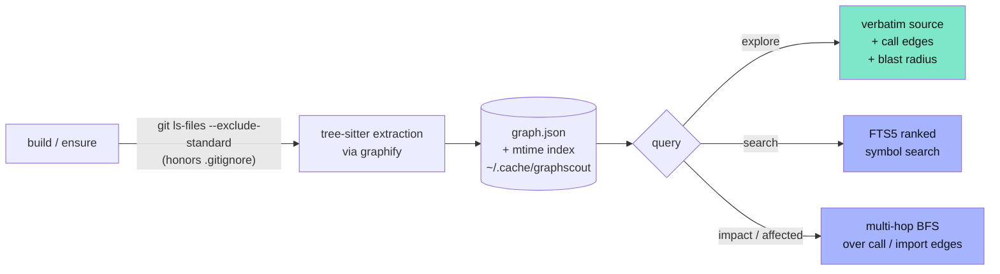

<div align="center">

# graphscout

**Cached, incremental code-graph maps so AI agents query code structure instead of reading whole files.**

[](https://pypi.org/project/graphscout/)
[](https://pypi.org/project/graphscout/)
[](https://github.com/nguyenminhduc9988/graphscout/actions/workflows/ci.yml)
[](https://pypi.org/project/graphscout/)
[](LICENSE)
[](https://github.com/nguyenminhduc9988/graphscout/stargazers)

[](https://github.com/nguyenminhduc9988/graphscout)


<sub>Real captured CLI output, not mockups — every line above comes from an actual `graphscout` run on this repo.</sub>

</div>

---

Agents burn most of their tokens reading source files to answer structural questions — "where is this defined?", "who calls this?", "what breaks if I change this?". `graphscout` answers those from a cached tree-sitter AST graph in milliseconds, and **`explore` returns the matching symbols' verbatim source plus their call edges and blast radius in one call** — so the agent usually doesn't need a follow-up `Read` at all.

<div align="center">

</div>

<sup>Measured, not asserted — see [Benchmark](#-benchmark) for methodology and how to reproduce it yourself.</sup>

One `build` per repo; after that, every query auto-refreshes only the files that changed since the last call (mtime-based). No forced background process, no external database, no API keys — a JSON cache under `~/.cache/graphscout`, plus an in-memory SQLite FTS5 index built on demand for search. Want it always fresh with zero per-query overhead instead? Run `graphscout watch`.

> Formerly published as `codegraph-kit` (repo `codegraph`) — renamed to avoid confusion with the unrelated, much larger [colbymchenry/codegraph](https://github.com/colbymchenry/codegraph). Same cache format (`$CODEGRAPH_CACHE` still works). See [Honest comparison](#-honest-comparison-vs-colbymchenrycodegraph) below for exactly where each tool wins.

## 📦 Install

```bash
pip install graphscout          # CLI
pip install "graphscout[mcp]"   # CLI + MCP server
pip install "graphscout[watch]" # CLI + instant filesystem-event auto-sync
```

Python ≥ 3.10. Parsing is done by [graphify](https://pypi.org/project/graphifyy/) (tree-sitter), with full def/call/import extraction for Python, JS/TS/TSX, Java, Groovy, C, C++, Ruby, C#, Kotlin, Scala, PHP, Lua, and Swift — and outline/import-level structure for 40+ more extensions (Go, Rust, Vue, Svelte, Astro, Dart, Elixir, Terraform, and more).

## ✨ What you get

| | |
|---|---|
| 🔎 **`explore` — one call, not four** | Verbatim source + callers/callees + multi-hop blast radius for the top-matching symbols. The shape an agent actually needs, instead of chaining `sym → file → callers → Read`. |
| 🧠 **Ranked full-text search** | In-memory SQLite FTS5 (bm25, prefix, multi-term) — not a plain substring scan — and docstring nodes are excluded so real symbols aren't drowned out by prose. |
| 💥 **Multi-hop impact analysis** | Bidirectional BFS over the call graph, depth-bounded — the *actual* blast radius of a change, not a one-hop callers/callees guess. |
| 🧪 **Test-impact from a diff** | `git diff --name-only \| graphscout affected --stdin` — which tests does this change touch, traced through resolved imports. |
| 🙈 **`.gitignore`-aware indexing** | Routes through `git ls-files --exclude-standard` in a git repo — nested `.gitignore`s and the global excludes file are honored exactly as git sees them. Hard-coded skips (`node_modules`, `vendor`, `dist`, …) apply regardless. |
| ⚙️ **`exclude` / `include` / `extensions` config** | Optional `graphscout.json` — force a vendored path back in, drop noisy generated code, or map a non-standard suffix onto a supported language. |
| ⚡ **Incremental, mtime-based cache** | One `build` per repo; every query re-extracts only what changed. No database server, no daemon required — `graphscout watch` is opt-in. |
| 🔌 **CLI *and* MCP** | Same queries either way — shell out from any agent, or wire the MCP server into Claude Code, Codex, Gemini CLI, and Cursor with one command. |

## 🧭 Commands

| Command | What it answers |
|---|---|
| `graphscout explore <query> [dir]` | **start here** — verbatim source + call edges + blast radius, one call |
| `graphscout search <query> [dir]` | ranked full-text symbol search (FTS5, multi-term, prefix) |
| `graphscout impact <name> [dir]` | multi-hop blast radius before changing a symbol (`--depth`) |
| `graphscout affected <file...>` | test files transitively affected by changed files (`--stdin`, `--depth`) |
| `graphscout map [dir]` | repo overview: size, per-directory breakdown, top hub symbols |
| `graphscout file <path>` | outline of one file: definitions + line ranges |
| `graphscout sym <name>` | where is this symbol defined? (plain substring match) |
| `graphscout callers <name>` / `callees <name>` | who calls it / what does it call (one hop) |
| `graphscout deps <path>` | what does this file import? |
| `graphscout build [dir]` / `ensure [dir]` | full build (once per repo) / incremental refresh (automatic) |
| `graphscout watch [dir]` | block, keeping the graph in sync as files change |
| `graphscout touch <path>` | re-extract one file (for editor/agent hooks) |
| `graphscout agent` | print an instruction snippet for your agent's context file |
| `graphscout install [agent...]` / `uninstall` | wire (or remove) the MCP server for detected agents |
| `graphscout mcp` | run as an MCP server (stdio) |

```bash
git diff --name-only | graphscout affected --stdin   # which tests does my diff touch?
graphscout impact CLIFallback --depth=4               # what breaks if I change this class?
```

## 🏗️ How it works



Every query calls `ensure` first — files whose mtime changed are re-extracted and spliced into the graph; deleted files drop out. Typical refresh touches a handful of files, so queries stay fast. Output is deliberately plain text with `file:line` locations — clickable in most agent UIs, trivially parseable by the rest.

Set `GRAPHSCOUT_CACHE` to relocate the cache (useful in CI and sandboxes).

## 🤖 Integrate with any agent

`graphscout` is plain CLI-over-stdout, so **any agent that can run shell commands can use it** — Claude Code, Codex CLI, Cursor, Aider, OpenHands, Goose, custom agents.

**1. Tell the agent the graph exists:**

```bash
graphscout agent >> AGENTS.md      # or CLAUDE.md, .cursorrules, .github/copilot-instructions.md
```

**2. (Optional) Keep the graph fresh on every edit.** For Claude Code, install the bundled PostToolUse hook so each `Edit`/`Write` re-extracts just that file:

```bash
cp integrations/claude-code/graphscout-touch.sh ~/.claude/hooks/
chmod +x ~/.claude/hooks/graphscout-touch.sh
# then merge integrations/claude-code/settings-snippet.json into ~/.claude/settings.json
```

Even without a hook, queries stay correct — every query runs an mtime check first and re-extracts anything stale.

### MCP, wired automatically

```bash
pip install "graphscout[mcp]"
graphscout install          # auto-detects and wires every agent found on PATH
graphscout install cursor   # or target specific agents: claude-code, codex, gemini, cursor
graphscout uninstall        # reverse it
```

`install` shells out to each agent's own `mcp add` command where one exists (Claude Code, Codex CLI, Gemini CLI — verified against their real CLIs, not guessed), and edits `~/.cursor/mcp.json` directly for Cursor. Idempotent — safe to re-run.

Tools exposed: `explore` (lead with this), `search`, `impact`, `affected`, `build_graph`, `graph_map`, `file_outline`, `find_symbol`, `callers`, `callees`, `file_deps`. The server's `instructions` steer the agent to `explore` first — one strong tool beats a menu of narrow ones.

### Auto-sync (optional)

```bash
graphscout watch          # blocks, keeps the graph in sync as you/your agent edit files
```

Uses [watchdog](https://pypi.org/project/watchdog/) for instant, low-CPU filesystem events when installed; falls back to a ~1.5s mtime poll otherwise. Alternative to the per-edit `touch` hook — run one or the other, not both.

## 🙈 Excludes, includes, custom extensions

Zero-config by default. Hard-coded skips (`.git`, `node_modules`, `venv`/`.venv`, `dist`, `build`, `target`, `vendor`, …) always apply, regardless of `.gitignore`. In a git repo, `.gitignore` is also honored via `git ls-files --exclude-standard` — nested `.gitignore`s and the global excludes file included, exactly as git itself sees them.

To go further, drop a `graphscout.json` at the repo root:

```json
{
  "exclude": ["static/", "**/generated/**"],
  "include": ["third_party/vendored_dep/"],
  "extensions": {".tpl": "php"}
}
```

`exclude` wins over everything, including `include`; `include` pulls a `.gitignore`d path back in but can't override the hard skip list. `extensions` maps a non-standard suffix onto a language graphify already parses.

## 📊 Benchmark

`python scripts/benchmark.py <repo>` compares the old `sym`+`file`+`callers`+`callees` workflow (4 calls, no verbatim source — a `Read` would still follow) against `explore` (1 call, source included), on real symbols picked from the target repo's own call graph. **Not a live-agent trial** — a reproducible, offline proxy anyone can re-run:

| Repo | Old calls → new | Old payload → new |
|---|---|---|
| this repo (119 nodes) | 20 → 5 (**75% fewer**) | 10,405 → 6,722 chars |
| [pallets/click](https://github.com/pallets/click) (1,803 nodes) | 20 → 5 (**75% fewer**) | 37,125 → 8,380 chars |

Call-count savings are structural (4 calls collapse to 1 regardless of repo size); payload savings vary with how verbose the old path's raw listings are versus one focused snippet.

<details>
<summary><b>Honest limitations</b> (printed in the output when they apply)</summary>

- **Dynamic dispatch isn't captured** — call edges come from static AST analysis; `getattr`-style calls need grep.
- **Unsupported/exotic languages** fall back to "read it directly".
- **`affected` under-detects on multi-name absolute imports** — `from pkg import a, b` resolves to one edge on the package, not per-name. Relative imports and single-name absolute imports resolve fully.
- **No line ranges from the extractor** — graphify records a start line per symbol, not start+end; `explore`'s snippet end is inferred as "the line before the next symbol in the same file" (capped at 60 lines).
- Caps: 5,000 files per repo, 1 MB per file (warned, not silent); blast-radius/impact traversal stops at 400 nodes (flagged `(truncated)`).

</details>

## ⚖️ Honest comparison vs. colbymchenry/codegraph

[colbymchenry/codegraph](https://github.com/colbymchenry/codegraph) is a funded, actively-developed product — 59k+ stars, a Node/TypeScript codebase with bundled runtime, measured cross-file coverage per language, and real published agent benchmarks. `graphscout` is a ~1,100-line single-purpose Python tool. Here's where each one actually wins:

| | graphscout | colbymchenry/codegraph |
|---|:---:|:---:|
| Verbatim source + call edges + blast radius, one call | ✅ `explore` | ✅ `codegraph_explore` |
| Ranked full-text search (FTS5) | ✅ | ✅ |
| Multi-hop impact / blast radius | ✅ | ✅ |
| Test-impact from a diff | ✅ `affected` | ✅ `affected` |
| `.gitignore`-aware indexing | ✅ | ✅ |
| Languages with full def/call/import extraction | 13 | **34** |
| Framework route detection | ❌ | ✅ **17 frameworks** |
| Cross-language bridging (Swift↔ObjC, React Native, Expo) | ❌ | ✅ |
| Native OS file-watch daemon | optional (`watchdog`) | ✅ built-in |
| Runtime | pure Python (no bundled runtime) | bundled Node.js runtime |
| Telemetry | **none, ever** | opt-out, anonymized |
| Published agent benchmarks | offline call/payload proxy (above) | live Claude-Code trials across 7 repos |
| License | MIT | MIT |

If you need 34-language coverage, iOS/React-Native bridging, or framework route detection, use codegraph. If you want a small, auditable, telemetry-free tool that does one thing — make every structural query self-sufficient for an agent — that's what `graphscout` optimizes for.

## 📈 Star History

<a href="https://www.star-history.com/#nguyenminhduc9988/graphscout&Date">
 <picture>
   <source media="(prefers-color-scheme: dark)" srcset="https://api.star-history.com/svg?repos=nguyenminhduc9988/graphscout&type=Date&theme=dark" />
   <source media="(prefers-color-scheme: light)" srcset="https://api.star-history.com/svg?repos=nguyenminhduc9988/graphscout&type=Date" />
   
 </picture>
</a>

## License

MIT
